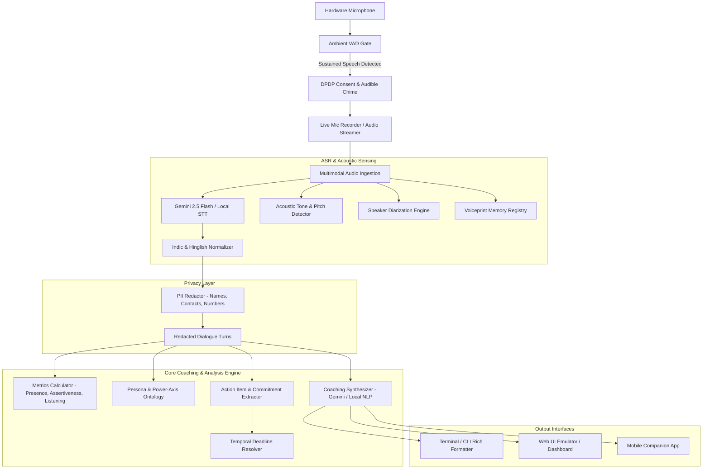

# Executive Communication Coach: Architecture & Module Guide

An intelligent, privacy-first, on-device AI communication coaching platform. The system listens to ambient conversations or microphone recordings, diarizes speakers, transcribes English, Hindi, and code-mixed Hinglish with high fidelity, and generates actionable, persona-tailored communication coaching and automated task commitments.

---

## 1. System Pipeline Architecture



---

## 2. Directory & Module Organization

The codebase is organized into three distinct layers: **Acoustic & Speech (ASR)**, **Coaching & NLP Engine**, and **Privacy Compliance**.

```
executive-comm-coach/
├── core/
│   ├── asr_diarization/          # Audio sensing, streaming, STT, and voice identification
│   │   ├── acoustic_speaker_detector.py  # Pitch, RMS energy, and vocal tone classifier
│   │   ├── diarizer.py                   # Speaker turn alignment, role assignment, overlap detection
│   │   ├── gemini_audio_engine.py        # Gemini 2.5 Flash multimodal transcription & diarization
│   │   ├── indic_normalizer.py           # Devanagari transliteration, Hinglish harmonization, non-verbal sounds
│   │   ├── live_mic_recorder.py          # Native sounddevice / CoreAudio real-time streaming recorder
│   │   ├── local_stt_engine.py           # Offline Faster-Whisper on-device STT fallback
│   │   ├── nvidia_parakeet_engine.py     # Local CTC/RNNT transducer STT integration
│   │   ├── sarvam_client.py              # Cloud Saarathi/Sarvam Indic speech client
│   │   ├── speaker_voiceprint_registry.py# Local acoustic MFCC voiceprint memory & auto-identification
│   │   └── vad_gater.py                  # Silero-style low-power ambient acoustic gate (<2.5% CPU)
│   │
│   ├── engine/                   # Linguistic analysis, scoring, and coaching synthesis
│   │   ├── action_item_extractor.py      # Extracts follow-ups, deliverables, meetings, and deadlines
│   │   ├── coaching_engine.py            # Primary coaching facade with automated cloud/local routing
│   │   ├── gemini_coaching_engine.py     # Deep semantic coaching and coached rephrasing via Gemini
│   │   ├── local_coaching_synthesizer.py # 100% on-device offline NLP coaching engine
│   │   ├── metrics_calculator.py         # Presence, assertiveness, and active listening quantitative scoring
│   │   ├── persona_ontology.py           # Rubrics for 6 registers: Solo, Casual, Peer, Executive, Mentorship, Conflict
│   │   ├── schema.py                     # Strict Pydantic / dataclass structured data definitions
│   │   ├── temporal_resolver.py          # Smart date/time resolver (AM/PM inference, EOD, Hinglish relative times)
│   │   └── transcription_analyzer.py     # High-level pipeline aggregating highlights, metrics, and tasks
│   │
│   ├── privacy/                  # Statutory compliance and data protection
│   │   ├── dpdp_compliance.py            # Consent logging, dual-tone chime, right to erasure
│   │   └── pii_redactor.py               # Pattern-based PII scrubbers (emails, phones, credentials)
│   │
│   ├── config.py                 # Environment, API keys, paths, and model settings
│   ├── record_live_coach.py      # Primary live microphone interactive coaching entry point
│   ├── cli_coach.py              # Lightweight offline transcript coaching CLI
│   └── server.py                 # REST & WebSocket API backend for Web and Mobile UIs
│
├── emulator/
│   └── index.html                # Interactive glassmorphic Web UI and mobile companion emulator
│
├── core/tests/                   # Comprehensive automated test suite (55+ unit & integration tests)
├── record.sh                     # One-click shell script for live microphone coaching
└── nudge.sh                      # Shell script for ambient conversation monitor
```

---

## 3. Core Data Contracts (`core/engine/schema.py`)

All engine components exchange strictly typed data models:

| Class | Description |
| :--- | :--- |
| `Utterance` | A single timestamped turn: `speaker`, `start_time`, `end_time`, `transcript`, `is_overlapping`, `overlap_duration_sec`, `interrupted_speaker`. |
| `CommunicationMetrics` | Quantitative delivery scores: `presence_score` [15–98], `assertiveness_score` [15–98], `active_listening_score` [15–98], `filler_words_detected`, `interruption_count`, `overlap_count`. |
| `ActionItem` | Committed task: `owner`, `task`, `due_time_or_date`, `resolved_datetime`, `category`, `urgency`. |
| `ExecutiveCoachingEvaluation` | Complete coaching output: `top_strengths`, `areas_for_improvement` (critique + original quote + polished rephrasing), `action_items`, `key_highlights`, `longitudinal_summary`. |
| `ConversationSession` | Complete session metadata: `session_id`, `power_axis`, `counterpart_name`, `counterpart_role`, `dialogue`. |

---

## 4. Key Workflows & Entry Points

### 1. Live Microphone Coaching
```bash
./record.sh
```
*Options:*
- Adjust silence pause duration: `./record.sh --silence 1.5`
- Choose communication mode: `./record.sh --axis UPWARD` (Options: `SOLO`, `CASUAL`, `LATERAL`, `UPWARD`, `DOWNWARD`, `CONFLICT`)
- Force local-only models: `./record.sh --local-only`
- Press <kbd>Enter</kbd> or <kbd>Ctrl+C</kbd> at any time to conclude recording immediately.

### 2. Ambient Conversation Detection & Nudge
```bash
./nudge.sh
```
Monitors the room with $< 2.5\%$ CPU. When conversation onset is detected, plays a gentle chime and prompts you to start coaching.

### 3. Interactive Web UI Emulator
```bash
./venv/bin/python core/server.py 8080
```
Open `http://localhost:8080/emulator/index.html` in your browser.

### 4. Running the Test Suite
```bash
./venv/bin/pytest -v
```
Runs the 117+ automated unit and integration tests covering ASR, diarization, VAD gating, Hinglish normalization, temporal resolution, and coaching synthesis.

---

## AI Attribution & Disclaimer Notice

> [!NOTE]
> **AI-Assisted Development**: This software tool and its architectural components were created and authored with the assistance of Artificial Intelligence (AI) models and agentic coding workflows. All algorithms and suggestions are intended for developmental, educational, and coaching purposes.

